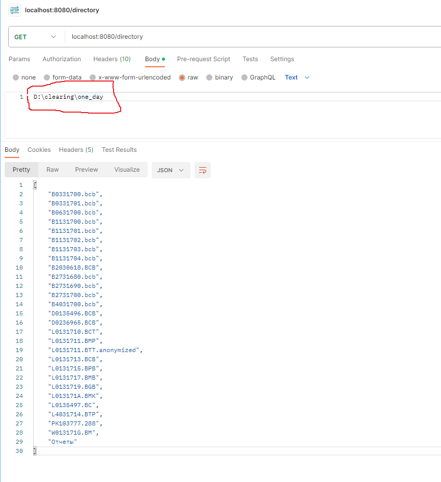
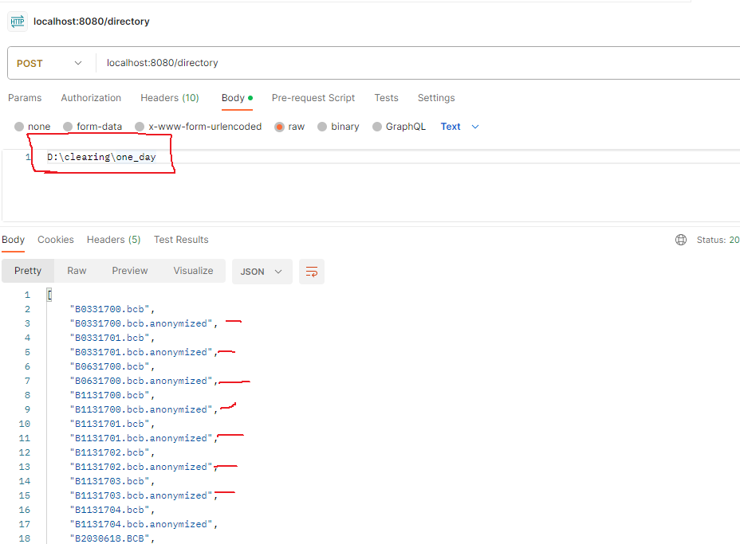

# Getting Started

### Version of Libraries
* java 17
* Spring Boot 3.1.5

### The operation time of application
2-3 minutes for Clearing files in 1 day

## API 

1. localhost:8080/directory  GET-request returns list of file in directory:

2. localhost:8080/directory  POST-request anonymize card number and expire date in files in directory:

Files with *.anonymized have encrypted card number (last 8 numbers) and expire date and 
сan be transferred to the development department